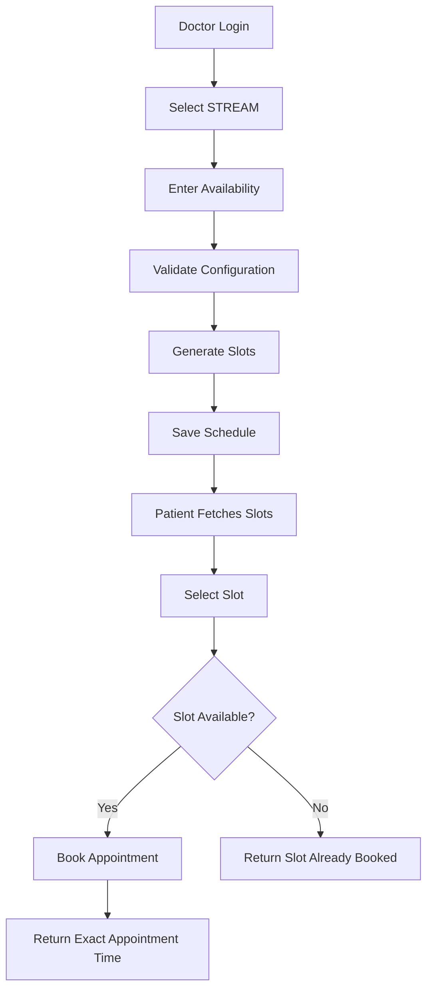

# Stream Scheduling Flow

```mermaid
flowchart TD
A[Doctor Login] --> B[Select STREAM]
B --> C[Enter Availability]
C --> D[Validate Configuration]
D --> E[Generate Slots]
E --> F[Save Schedule]
F --> G[Patient Fetches Slots]
G --> H[Select Slot]
H --> I{Slot Available?}
I -->|Yes| J[Book Appointment]
I -->|No| K[Return Slot Already Booked]
J --> L[Return Exact Appointment Time]
```