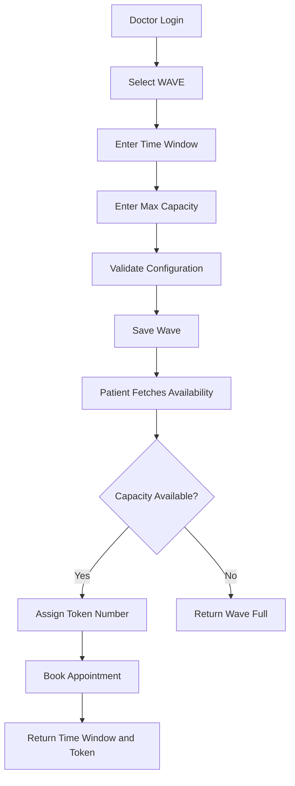

# Wave Scheduling Flow

```mermaid
flowchart TD
A[Doctor Login] --> B[Select WAVE]
B --> C[Enter Time Window]
C --> D[Enter Max Capacity]
D --> E[Validate Configuration]
E --> F[Save Wave]
F --> G[Patient Fetches Availability]
G --> H{Capacity Available?}
H -->|Yes| I[Assign Token Number]
H -->|No| J[Return Wave Full]
I --> K[Book Appointment]
K --> L[Return Time Window and Token]
```